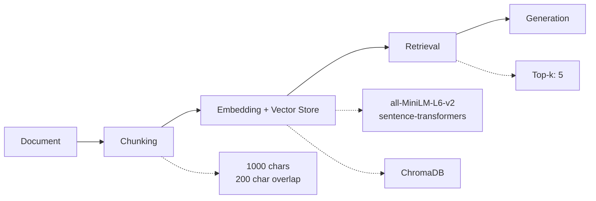

# Project 1 Planning: The Unofficial Guide

> Write this document before you write any pipeline code.
> Your spec and architecture diagram are what you'll use to direct AI tools (Claude, Copilot, etc.) to generate your implementation — the more specific they are, the more useful the generated code will be.
> Update the Retrieval Approach and Chunking Strategy sections if you change your approach during implementation.
> Update this file before starting any stretch features.

---

## Domain

<!-- What domain did you choose? Why is this knowledge valuable and hard to find through official channels? -->
This guide covers indie game artists transitioning from digital art into game development; the tools, workflows, mental hurdles, and technical gaps that come with building games from an art-first perspective. Most game dev resources assume a programming background, and most art resources stop at the canvas; leaving artist-developers to piece together advice from scattered blogs, Reddit threads, interviews, and postmortems. No single resource aggregates what it actually looks like to adapt illustration skills into game-ready assets, pick an engine as a visual thinker, or learn to code without losing creative momentum.

---

## Documents

<!-- List your specific sources: URLs, subreddit names, forum threads, or file descriptions.
     Aim for at least 10 sources that together cover different subtopics or perspectives within your domain. -->

| # | Source | Description | URL or location |
|---|--------|-------------|-----------------|
| 1 | Medium | Year-long journal from a UX designer with zero coding experience learning pixel art and game dev from scratch | https://medium.com/@kuppy_kp_/a-f-cking-long-journal-from-a-ux-designer-who-became-an-indie-game-dev-artist-in-2023-10345a61bbbb |
| 2 | 80.lv | In-depth interview with a developer who made the full switch from game artist to indie dev, covering tools, pipelines, and engine choices | https://80.lv/articles/the-journey-from-an-artist-to-a-game-developer |
| 3 | Juego Studios | Covers Photoshop, Clip Studio Paint, and Aseprite and how each fits into an indie game art workflow | https://www.juegostudio.com/blog/best-tools-for-art-and-design |
| 4 |  GitHub | Curated resource list with sections on art-to-tech topics: shader guides, tech art courses, and VFX pipelines | https://github.com/dawdle-deer/awesome-learn-gamedev  |
| 5 | pixune.com | Detailed breakdown of the full game art pipeline from concept art through animation, texturing, and engine integration | https://pixune.com/blog/game-art-pipeline/ |
| 6 | r/gamedev |Reddit thread where a programmer vents about the difficulty of learning art as a non-artist, generating a long community discussion covering free vs. paid tools, learning resources, the art vs. programming learning curve debate, and practical advice for getting passable game art without formal training. | https://www.reddit.com/r/gamedev/comments/qqbyqo/it_seems_artists_have_an_easier_time_becoming/ |
| 7 | r/IndieDev | Thread where a solo developer with zero art background asks how others tackled visuals, generating detailed responses covering style choices (low-poly, pixel art), shader-based workarounds, hiring artists, using asset packs coherently, and a developer's firsthand account of going from terrible programmer art to a polished visual style over 1.5 years with no art training. |  https://www.reddit.com/r/IndieDev/comments/1qf2xn1/solo_dev_struggling_with_artvisuals_how_did_you/ |
| 8 | gamedeveloper.com | Long-form blog post from a solo dev who came from a game artist background and had to learn coding, giving a rare flip-side perspective on the art/code divide | https://www.gamedeveloper.com/business/making-it-work-as-a-solo-game-developer |
| 9 | gamedeveloper.com | A startup guide written specifically for illustrators and classically trained artists moving into game asset creation - covering the key constraints, workflow differences, and mindset shifts that trip up artists coming from a fine art or freelance illustration background. | https://www.gamedeveloper.com/art/illustrators-four-things-your-indie-coder-wants-you-to-know-about-game-art |
| 10 | Creative Bloq | Five indie game artists explain how their visual background directly shaped the worlds, stories, and emotions of their games — covering art direction, style development, and how artistic choices drive gameplay decisions, all from an artist-first perspective. | https://www.creativebloq.com/art/digital-art/how-art-lays-the-foundations-for-indie-games |

---

## Chunking Strategy

<!-- How will you split documents into chunks?
     State your chunk size (in tokens or characters), overlap size, and explain why those
     numbers fit the structure of your documents.
     A review-heavy corpus warrants different chunking than a long FAQ. -->

**Chunk size:**

1000 characters

**Overlap:**

200 characters overlap

**Reasoning:**

My documents are long-form interviews, blog posts, and Reddit discussions where ideas are expressed across multiple sentences. A 1000-character chunk provides enough room to capture a complete thought or argument without cutting off mid-idea. The 200-character overlap ensures that context carries over at chunk boundaries, important for interview-style documents where a question and its answer may span adjacent chunks.

---

## Retrieval Approach

<!-- Which embedding model are you using (e.g., all-MiniLM-L6-v2 via sentence-transformers)?
     How many chunks will you retrieve per query (top-k)?
     If you were deploying this for real users and cost wasn't a constraint, what tradeoffs
     would you weigh in choosing a different embedding model — context length, multilingual
     support, accuracy on domain-specific text, latency? -->

**Embedding model:**

all-MiniLM-L6-v2 via sentence-transformers

**Top-k:**

5 

**Production tradeoff reflection:**

If I were deploying this for real users and cost wasn't a constraint, I would consider a model like text-embedding-3-large (OpenAI) or embed-english-v3.0 (Cohere) for better accuracy on domain-specific language. My documents mix technical game dev vocabulary with artistic terminology; a larger, more capable embedding model would handle that intersection more reliably than all-MiniLM-L6-v2, which is optimized for speed over nuance. I would also weigh context length, since some of my chunks come from long interviews where meaning is spread across sentences; a model with a larger context window would embed those more faithfully. The main tradeoff is latency: larger models are slower and more expensive.

---

## Evaluation Plan

<!-- List your 5 test questions with their expected correct answers.
     Questions should be specific enough that you can judge whether the system's response
     is right or wrong. "What are good dining halls?" is too vague.
     "What do students say about wait times at [dining hall name] during lunch?" is testable. -->

| # | Question | Expected answer |
|---|----------|-----------------|
| 1 | What kinds of artists or designers transition into indie game development? | UX designers, illustrators, 3D artists, concept artists, and traditional fine artists; each bringing different strengths and facing different technical gaps [Medium, 80.lv, gamedeveloper.com #9]|
| 2 |  What game engines do artist-first developers most commonly recommend for beginners with no coding background?  | Godot is frequently recommended for its free, lightweight nature and beginner-friendly GDScript; other engines are chosen based on project type rather than one-size-fits-all [Medium, 80.lv, r/IndieDev] |
| 3 |  What are the biggest struggles artists face when learning to code for game development? | Moving from visual thinking to logic-based programming, choosing the right engine, and the lack of structured learning paths designed for artists rather than programmers [r/gamedev, r/IndieDev, gamedeveloper.com #8] |
| 4 | How do solo indie developers with an art background handle the parts of game dev they're weakest at? | Common strategies include collaborating with a programmer, using visual scripting tools, leaning into art-heavy styles that minimize complex code, or spending dedicated time learning one engine deeply [r/IndieDev, gamedeveloper.com #8, gamedeveloper.com #9] |
| 5 | What art styles are most recommended for artists transitioning into game dev with limited technical resources? | Low-poly, pixel art, and minimalist styles are consistently recommended as forgiving and achievable; tool choices like Aseprite and Clip Studio Paint are highlighted for artists already comfortable with digital tools [r/IndieDev, Juego Studios, pixune.com, Creative Bloq] |

---

## Anticipated Challenges

<!-- What could go wrong? Name at least two specific risks with reasoning.
     Consider: noisy or inconsistent documents, missing source attribution, off-topic
     retrieval, chunks that split key information across boundaries. -->

1. **Inconsistent and anecdotal sources:** My documents span interviews, Reddit threads, and blog posts — each structured differently and written from personal experience. This means retrieved chunks may contradict each other (e.g. one dev recommending Godot while another warns against it for artists), making it harder for the system to produce a single coherent answer. Handling conflicting perspectives without dismissing either will require careful prompt design.

2. **Noisy chunks from long-form discussions:** Reddit threads and interview transcripts contain significant off-topic content — tangents, jokes, promotional asides, and follow-up comments that dilute the signal. A 1000-character chunk from a Reddit thread might contain one useful sentence surrounded by noise, leading to off-topic retrieval. Pre-processing and careful source selection will be important to mitigate this.

---

## Architecture

<!-- Draw a diagram of your pipeline showing the five stages:
     Document Ingestion → Chunking → Embedding + Vector Store → Retrieval → Generation
     Label each stage with the tool or library you're using.
     You can use ASCII art, a Mermaid diagram, or embed a sketch as an image.
     You'll use this diagram as context when prompting AI tools to implement each stage. -->

---

## AI Tool Plan

<!-- For each part of the pipeline below, describe:
     - Which AI tool you plan to use (Claude, Copilot, ChatGPT, etc.)
     - What you'll give it as input (which sections of this planning.md, which requirements)
     - What you expect it to produce
     - How you'll verify the output matches your spec

     "I'll use AI to help me code" is not a plan.
     "I'll give Claude my Chunking Strategy section and ask it to implement chunk_text()
     with my specified chunk size and overlap" is a plan. -->

I plan to use Claude as my primary tool throughout the pipeline, with Copilot for in-editor autocomplete and ChatGPT occasionally for cross-referencing outputs.

**Chunking (`chunk_text()`):** I will give Claude my Chunking Strategy section (1000-character chunks, 200-character overlap) and ask it to implement a `chunk_text()` function matching those exact parameters. I will verify the output by running it on a sample document and manually confirming chunk sizes and overlap boundaries are correct.

**Embedding & Retrieval:** I will give Claude my Retrieval Approach section (all-MiniLM-L6-v2, top-5) and ask it to implement the embedding and retrieval pipeline. I will verify by querying with one of my evaluation questions and checking that 5 relevant chunks are returned.

**RAG Pipeline:** I will give Claude the full planning.md and ask it to wire together the chunking, embedding, retrieval, and generation steps into a working pipeline. I will verify the output against my Evaluation Plan by running all 5 test questions and checking that answers align with expected responses.

**Debugging:** When outputs are unexpected, I will share the relevant code and retrieved chunks with Claude and ask it to identify where the pipeline is breaking down. I will cross-reference with ChatGPT if Claude's explanation is unclear.

**Milestone 3 — Ingestion and chunking:**

**Milestone 4 — Embedding and retrieval:**

**Milestone 5 — Generation and interface:**
